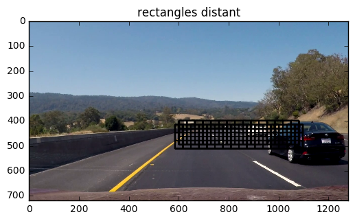

## Writeup / README

**Vehicle Detection Project**

The goals / steps of this project are the following:

* Perform a Histogram of Oriented Gradients (HOG) feature extraction on a labeled training set of images and train a classifier Linear SVM classifier
* Optionally, you can also apply a color transform and append binned color features, as well as histograms of color, to your HOG feature vector.
* Note: for those first two steps don't forget to normalize your features and randomize a selection for training and testing.
* Implement a sliding-window technique and use your trained classifier to search for vehicles in images.
* Run your pipeline on a video stream (start with the test_video.mp4 and later implement on full project_video.mp4) and create a heat map of recurring detections frame by frame to reject outliers and follow detected vehicles.
* Estimate a bounding box for vehicles detected.

Here are links to the labeled data for [vehicle](https://s3.amazonaws.com/udacity-sdc/Vehicle_Tracking/vehicles.zip) and [non-vehicle](https://s3.amazonaws.com/udacity-sdc/Vehicle_Tracking/non-vehicles.zip) examples to train your classifier.  These example images come from a combination of the [GTI vehicle image database](http://www.gti.ssr.upm.es/data/Vehicle_database.html), the [KITTI vision benchmark suite](http://www.cvlibs.net/datasets/kitti/), and examples extracted from the project video itself.   You are welcome and encouraged to take advantage of the recently released [Udacity labeled dataset](https://github.com/udacity/self-driving-car/tree/master/annotations) to augment your training data.  

In the following I will consider the [rubric points](https://review.udacity.com/#!/rubrics/513/view)  individually and
describe how I addressed each point in my implementation.  

---

#### Histogram of Oriented Gradients (HOG).

The code for this step is contained in the third code cell of the IPython notebook
(method is called `get_hog_features()`).  

I started by reading in all the `vehicle` and `non-vehicle` images.  Here is an example of one of each of the `vehicle` and `non-vehicle` classes:

I then explored different color spaces and different `cv2.hog()` parameters (`orientations`, `pixels_per_cell`, and `cells_per_block`).  I grabbed random images from each of the two classes and displayed them to get a feel for what the `skimage.hog()` output looks like.

Here is an example using the `YCrCb` color space and HOG parameters of

    ORIENT = 11 # HOG orientations
    PIX_PER_CELL = 16 # HOG pixels per cell
    CELL_PER_BLOCK = 2 # HOG cells per block
    HOG_CHANNEL = "ALL" # Can be 0, 1, 2, or "ALL"

#### Final choice of HOG parameters.

LUV and YUV both worked nice with anything but HOG, but LUV yielded negative values in
one channel, which do not work with the `sqrt()` built into `hog()`.

I tried various combinations of parameters and finally settled for the `COLOR_SPACE = 'YUV'` since was recommended according to my research and own experiments.

#### Training a classifier.

Describe how (and identify where in your code) you trained a classifier using your selected HOG features (and color features if you used them).

Prior to training, the features were scaled. I only used HOG features, and no
color histogram or spatial (which are basically the pixel values) features.

I trained a linear SVM using the provided, labeled datasets. I used the library
`sklearn` to do so. This happens in cell number 8:

    svc = svm.LinearSVC()
    svc.fit(X_train, y_train)

After that, I calculated the accuracy to draw conclusions for the the above
mentioned HOG features.

### Sliding Window Search.

The sliding window search is implemented in cell 12. After that, I optimized
the parameters visually. The basic idea was that the areas where windows are
present follow the shape of the street. Also, the greater the distance
between the car and the search area in street coordinates was, the smaller
the windows was.

Overlapping was chosen to be approximately the half.

Here are some examples for different distances (at total, 5 different distances/
  window sizes were used).

####2. Show some examples of test images to demonstrate how your pipeline is working.  What did you do to optimize the performance of your classifier?

Ultimately I searched on two scales using LUV HOG features **without** spatially binned color and **without** histograms of color in the feature vector, which provided a nice result.  Here are some example images:

---

### Video Implementation

#### Video

Here's a [link to my video result](./output/project_video.mp4)

#### Filtering false positives and combining overlapping boundaries

To tackle false positives, I restricted the sliding window search to areas where
there is actually street (e.g. no sky, no areas in the middle of image to very
  right and left).

In short: To combine overlapping bounding boxes I used a heatmap concept: Every bounding
box "heats" up all pixels within. Afterwards, "hot" areas are accumulated to
car objects.

More precisely: I recorded the positions of positive detections in each frame of the video.  From the positive detections I created a heatmap and then thresholded that map to identify vehicle positions.  I then used `scipy.ndimage.measurements.label()` to identify individual blobs in the heatmap.  I then assumed each blob corresponded to a vehicle.  I constructed bounding boxes to cover the area of each blob detected.  

Here's an example result showing the heatmap from a series of frames of video, the result of `scipy.ndimage.measurements.label()` and the bounding boxes then overlaid on the last frame of video:

Here is a frame and its corresponding heatmap:

Also, I introduced a concept of sustained "heat" and cooling. Hot pixels are considered
in the following frame. If a car is no longer detected, the pixels still "glows"
a little bit. Every pixels heat is lower by a configurable delta each frame. If no
object is detected for multiple frame, the pixel will always reach the "cool"
state. This way the car position is tracked **over several subsequent frames**, which
helps to of rejecting false positives (since the threshold to be considered a
  car was raised at the same time).

Given the above image, if imidiately after that (next frame) no cars were detected,
the heatmap slowly cooles:

---

### Discussion

Here I'll talk about the approach I took, what techniques I used, what worked and why, where the pipeline might fail and how I might improve it if I were going to pursue this project further:

- If I had more computing power, I would definitely add more windows to be searched/
classified. Right now, the translation from one window to the next (especially when
  the size differs) can be rough.
- Use the lane detection from the previous project to defined the areas where
the sliding window search is performed.
- Evaluate more classifiers and hyperparameters.
- Optimize the classifier not to accuracy, but to recall, precision, or e.g. to
the area under the precision recall curve.
- Use the information from the last frame not as simple input, but
move (e.g. the bounding boxes) according the vehicle closer to the car.
